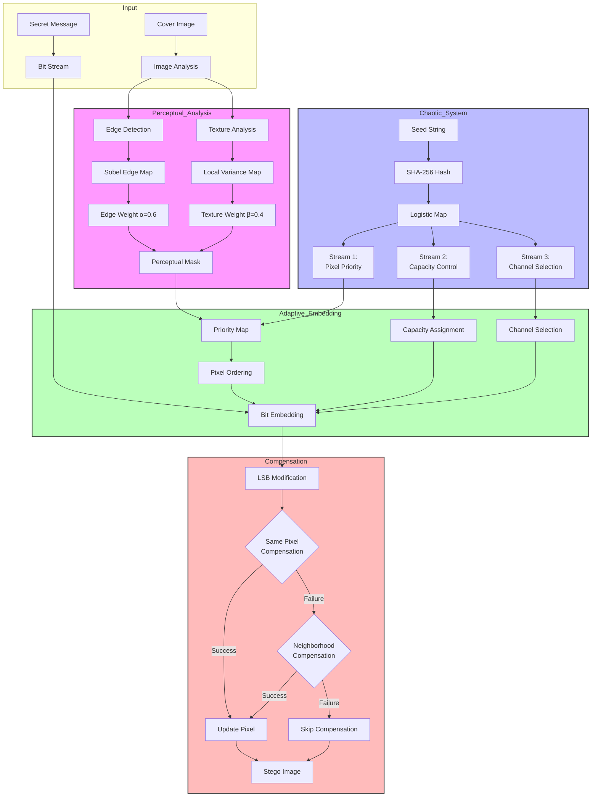

```mermaid
graph TB
    subgraph Input
        A[Cover Image] --> B[Image Analysis]
        M[Secret Message] --> N[Bit Stream]
    end

    subgraph Perceptual_Analysis
        B --> C[Edge Detection]
        B --> D[Texture Analysis]
        C --> E[Sobel Edge Map]
        D --> F[Local Variance Map]
        E --> G[Edge Weight α=0.6]
        F --> H[Texture Weight β=0.4]
        G --> I[Perceptual Mask]
        H --> I
    end

    subgraph Chaotic_System
        S[Seed String] --> T[SHA-256 Hash]
        T --> U[Logistic Map]
        U --> V1[Stream 1:<br/>Pixel Priority]
        U --> V2[Stream 2:<br/>Capacity Control]
        U --> V3[Stream 3:<br/>Channel Selection]
    end

    subgraph Adaptive_Embedding
        I --> W[Priority Map]
        V1 --> W
        W --> X[Pixel Ordering]
        V2 --> Y[Capacity Assignment]
        V3 --> Z[Channel Selection]
        N --> P[Bit Embedding]
        X --> P
        Y --> P
        Z --> P
    end

    subgraph Compensation
        P --> Q[LSB Modification]
        Q --> R1{Same Pixel<br/>Compensation}
        R1 -->|Success| R3[Update Pixel]
        R1 -->|Failure| R2{Neighborhood<br/>Compensation}
        R2 -->|Success| R3
        R2 -->|Failure| R4[Skip Compensation]
        R3 --> O[Stego Image]
        R4 --> O
    end

    style Perceptual_Analysis fill:#f9f,stroke:#333,stroke-width:2px
    style Chaotic_System fill:#bbf,stroke:#333,stroke-width:2px
    style Adaptive_Embedding fill:#bfb,stroke:#333,stroke-width:2px
    style Compensation fill:#fbb,stroke:#333,stroke-width:2px
```